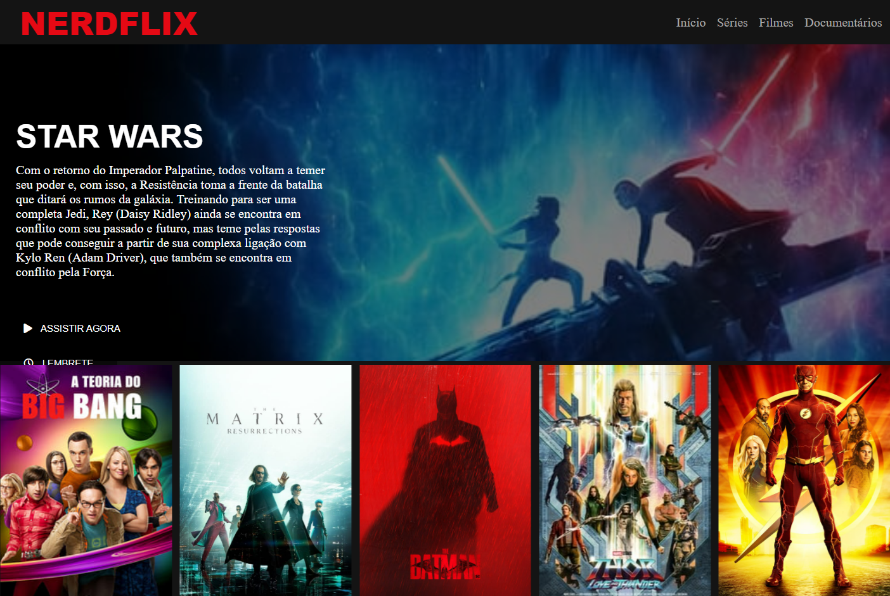

# NerdFlix Clone

## Bootcamp HTML Web Developer 02

> Plataforma Digital Innovation One

 02 Projeto - Recriando a Interface do Netflix.

Projeto realizado durante Bootcamp HTML Web Developer na plataforma da DIO, realizado durante as aulas. 
Desenvolvido 24/11/2021

[ 📎 Clique aqui para acessar] (https://michel-maia.github.io/Projeto-Nerdflix/)

 ## Tecnologias 🖥️ 🚀 

- HTML
- CSS
- JavaScript
- Git e GitHub
